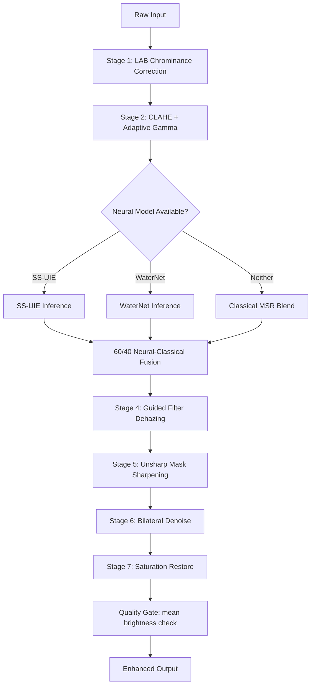
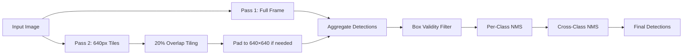
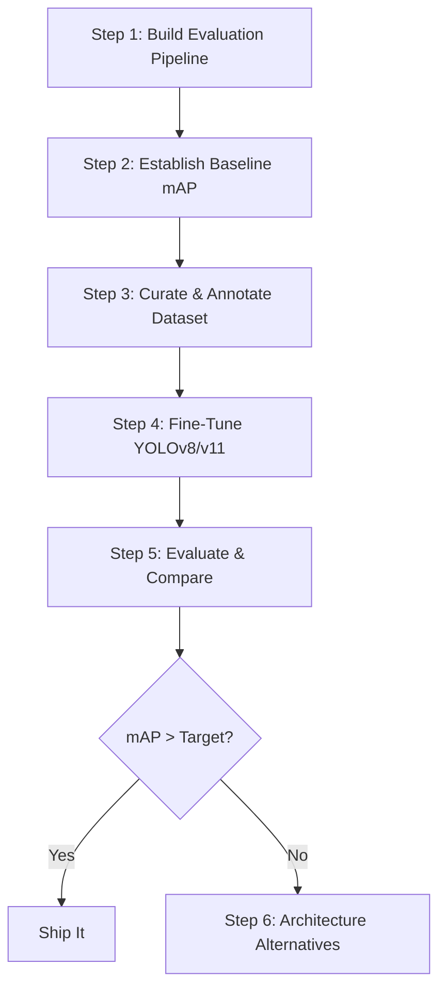

# 🌊 Underwater Image Reconstruction — Full Technical Analysis

> **Project**: [Underwater-Image-reconstruction](file:///c:/Users/athar/OneDrive/Desktop/Projects/Underwater-Image-reconstruction)
> **Org**: UnderWater-Machine-Learning-Project
> **Date**: April 11, 2026

---

## 1. Executive Summary

This project implements a **two-stage pipeline** for underwater image processing:

| Stage | Purpose | Core Tech |
|-------|---------|-----------|
| **Stage 1 — Enhancement** | Restore degraded underwater images (color cast, haze, low contrast) | SS-UIE (neural) + WaterNet (neural) + Classical CV |
| **Stage 2 — Detection** | Identify and localize marine species | YOLOv8 (15-class `fish_model.pt`) with tiled inference |

The pipeline reads images from `images/`, produces side-by-side comparison outputs in `outputs/`, and prints structured detection metrics to the terminal.

---

## 2. Project Structure

```
Underwater-Image-reconstruction/
├── main.py              ← Pipeline orchestrator (detection + visualization)
├── enhance.py           ← 7-stage image enhancement engine
├── ssuie_arch.py        ← SS-UIE neural network architecture (Mamba + Spectral)
├── config.py            ← Folder paths (IMAGE_FOLDER, OUTPUT_FOLDER)
├── requirements.txt     ← Python dependencies
├── .gitignore           ← Excludes model weights, outputs, images
├── README.md            ← Setup instructions + sample outputs
└── images/              ← Input test images (6 JPGs)
    ├── test.jpg
    ├── test2.jpg
    ├── test3.jpg
    ├── test_0013.jpg
    ├── test_0015.jpg
    └── test_0032.jpg
```

> [!NOTE]
> Model weights (`fish_model.pt`, `SS_UIE.pth`) are `.gitignore`d and downloaded separately.

---

## 3. Tech Stack

| Layer | Technology | Version |
|-------|-----------|---------|
| Language | Python | 3.x |
| Deep Learning Framework | PyTorch | ≥ 2.0.0 |
| Vision Library | TorchVision | ≥ 0.15.0 |
| Object Detection | Ultralytics (YOLO) | ≥ 8.0.0 |
| Image Processing | OpenCV | ≥ 4.8.0 |
| Numerical Computing | NumPy | ≥ 1.24.0 |
| Image I/O | Pillow | ≥ 10.0.0 |
| Progress Bars | tqdm | ≥ 4.66.0 |

**External Model Sources:**
- `fish_model.pt` — 15-class fish detector hosted on Azure Blob Storage
- `SS_UIE.pth` — SS-UIE weights (79MB) hosted on Google Drive
- WaterNet — loaded via `torch.hub` from `tnwei/waternet`

---

## 4. Enhancement Pipeline (Stage 1) — Deep Dive

The enhancement engine in [enhance.py](file:///c:/Users/athar/OneDrive/Desktop/Projects/Underwater-Image-reconstruction/enhance.py) is a **7-stage sequential pipeline** with optional neural model injection:

### 4.1 Cast Detection (Adaptive)
Before any processing, the system analyzes channel means (B, G, R) to compute:
- `cast_b` — blue cast intensity (open-water degradation)
- `cast_g` — green cast intensity (turbid/coastal degradation)
- `cast` — max of both, used to scale correction strength dynamically

### 4.2 Processing Stages



| Stage | Technique | Details |
|-------|-----------|---------|
| **1. LAB Correction** | Chrominance axis shifting | Pushes `a`-channel (green↔red) and `b`-channel (blue↔yellow) toward neutral (128). Strength scales with `cast`. |
| **2. CLAHE + Gamma** | Contrast Limited Adaptive Histogram Equalization | `clipLimit=2.5`, `tileGrid=8×8` on L-channel. Gamma LUT: `γ ∈ [0.50, 0.90]` adaptive to brightness. |
| **3a. SS-UIE** | Neural enhancement (AAAI 2025 architecture) | Mamba-Spectral attention with DenseMemory blocks. Encoder: 3→16→32→64, Bottleneck: 4× DenseMemory, Decoder: 64→32→16→3. |
| **3b. WaterNet** | Gated fusion CNN | Combines White-Balance, Histogram-EQ, Gamma-Corrected inputs via learned confidence maps. Loaded via `torch.hub`. |
| **3c. MSR Blend** | Multi-Scale Retinex (fallback) | Three Gaussian scales σ=[15,80,250]. Blended at 25% with corrected base to avoid blowout. |
| **4. Guided Dehazing** | He et al. 2013 guided filter | Edge-preserving scatter removal. Skipped for very dark (`brightness < 80`) or extreme cast (>0.80). |
| **5. Sharpening** | Unsharp mask (σ=1.5, amount=0.35) | Replaced FFT injection which caused confetti artifacts in turbid images. |
| **6. Denoise** | Bilateral filter | `d=5, σColor=25, σSpace=25` — edge-preserving noise reduction. |
| **7. Saturation** | HSV saturation boost | `S × (1.15 + 0.15×cast)` — compensates depth absorption of red/warm tones. |

### 4.3 SS-UIE Architecture ([ssuie_arch.py](file:///c:/Users/athar/OneDrive/Desktop/Projects/Underwater-Image-reconstruction/ssuie_arch.py))

The SS-UIE model is a sophisticated encoder-bottleneck-decoder with:

| Component | Architecture | Purpose |
|-----------|-------------|---------|
| **Input Fusion** | Learnable softmax weights over 4 inputs (raw, WB, CE, GC) | Adaptive input weighting |
| **Encoder** | BNConv: 3→16→32→64 | Feature extraction |
| **Bottleneck** | 4× DenseMemory blocks, each with 4× RecursiveUnits | Deep feature refinement |
| **RecursiveUnit** | `BN → ReLU → MambaSpec` (×2) | Spatial-spectral dual-domain processing |
| **MambaSpec** | Parallel `SpecBlock` + `MambaBlock` fused via 1×1 conv | Combines frequency-domain attention with SSM |
| **SpecBlock** | Position encoding → Spectral FFT filter → MLP | Frequency-domain feature modulation |
| **MambaBlock** | Lightweight Mamba-SSM (expand=2) with depth-wise conv | State-space sequential modelling |
| **Decoder** | BNConv: 64→32→16→3 + Sigmoid | Image reconstruction |

---

## 5. Detection Pipeline (Stage 2) — Deep Dive

The detection system in [main.py](file:///c:/Users/athar/OneDrive/Desktop/Projects/Underwater-Image-reconstruction/main.py) uses a pre-trained **YOLO model** (`fish_model.pt`) for 15-class marine species detection.

### 5.1 Model Specifications

| Property | Value |
|----------|-------|
| Architecture | YOLOv8 (Ultralytics) |
| Weights | `fish_model.pt` (FishInv) — pre-trained, Azure-hosted |
| Classes | 15 underwater species |
| Input Size | 640×640 |
| Confidence Threshold | 0.15 (very low — aggressive recall) |
| IoU Threshold | 0.45 |

### 5.2 Two-Pass Tiled Inference



**Why two passes?**
- **Pass 1 (full frame)**: Catches large and medium objects
- **Pass 2 (tiled)**: Catches small fish that get compressed below detection threshold during full-frame resize

### 5.3 Box Validity Filters

| Filter | Threshold | Purpose |
|--------|-----------|---------|
| Minimum Area | ≥ 400 px² | Removes sub-pixel noise |
| Maximum Area | ≤ 20% of frame | Removes whole-scene false positives |
| Aspect Ratio | ≤ 5:1 | Removes non-fish-shaped artifacts |

### 5.4 Two-Stage NMS

1. **Per-Class NMS**: Standard IoU-based suppression within each class → removes tile duplicates
2. **Cross-Class NMS**: Generic label (`"fish"`) collapses onto overlapping species-specific labels → the specific label always wins

### 5.5 Metrics Reported (Terminal)

| Metric | Formula | Purpose |
|--------|---------|---------|
| Area | `bw × bh` | Object size in pixels |
| Diameter | `(bw + bh) / 2` | Average spatial extent |
| Circularity | `min(bw,bh) / max(bw,bh)` | Shape compactness (1.0 = square) |

---

## 6. Current Issues & Improvement Opportunities

### 6.1 Code Quality & Engineering

| Issue | Severity | Details |
|-------|----------|---------|
| 🔴 **Git merge conflict markers** | Critical | Lines 13-44 of `main.py` contain unresolved `<<<<<<< HEAD` / `>>>>>>> 3b829e8` markers |
| 🟡 **Dead config.py** | Medium | `config.py` defines `IMAGE_FOLDER`/`OUTPUT_FOLDER` but `main.py` hardcodes its own copies |
| 🟡 **No CLI interface** | Medium | No `argparse` — paths, thresholds, model selection are all hardcoded |
| 🟡 **No type hints** | Medium | Functions like `_nms`, `_forward`, `detect` lack type annotations |
| 🟡 **Compressed code style** | Medium | One-liner variable assignments hinder readability (`ix1=max(...)`) |
| 🟢 **No logging** | Low | Uses bare `print()` instead of Python's `logging` module |
| 🟢 **No unit tests** | Low | Zero test coverage on any component |

### 6.2 Enhancement Pipeline

| Improvement | Impact | Description |
|-------------|--------|-------------|
| **Learnable ensemble fusion** | High | Current 60/40 neural-classical blend is hardcoded. A lightweight learnable fusion (even a simple Conv1×1 attention) would adapt per-image. |
| **Adaptive CLAHE parameters** | Medium | `clipLimit=2.5` and `tileGrid=8×8` are static. These should scale with image resolution and degradation level. |
| **SS-UIE input preparation** | Medium | The `infer_ssuie()` function passes only the raw image — but SS-UIE expects 4 inputs (raw, WB, CE, GC). This means the model is running on incomplete input, likely degrading its performance significantly. |
| **Quality metric** | Medium | The "quality gate" (`mean brightness ≥ 75%`) is too simplistic. Use UCIQE or UIQM (underwater-specific metrics). |
| **Batch processing** | Low | Images processed sequentially. GPU utilization is suboptimal. |

> [!WARNING]
> **Critical finding**: The SS-UIE model architecture in `ssuie_arch.py` defines a `forward(self, raw, wb, ce, gc)` accepting **4 tensors**, but `infer_ssuie()` in `enhance.py` only passes a **single tensor** (line 69: `model(t)`). This means the model is either:
> 1. Crashing silently and falling back to classical enhancement, OR
> 2. The `load_state_dict(strict=False)` is masking a different architecture being loaded
>
> **This must be investigated** — it could mean SS-UIE is never actually contributing to enhancement.

### 6.3 Detection Pipeline

| Improvement | Impact | Description |
|-------------|--------|-------------|
| **Detection on enhanced image** | 🔴 High | Currently detection runs on the **raw original** only. Running on both raw + enhanced and merging results would significantly improve recall in degraded conditions. |
| **Confidence threshold tuning** | High | `conf=0.15` is extremely aggressive — likely generates many false positives. Needs per-class calibration. |
| **Multi-scale inference** | Medium | Currently uses fixed 640px tiles. Adding a 1280px pass would catch medium-sized fish better. |
| **Model evaluation pipeline** | Medium | No mAP, precision, recall, F1 metrics. No validation set. No way to quantify improvement. |
| **Class-specific NMS thresholds** | Medium | Different species have different overlap profiles. A single `IoU=0.45` is suboptimal. |
| **Tracking for video** | Low | Pipeline only handles images. No DeepSORT/ByteTrack for video sequences. |

---

## 7. YOLO Detection — The Main Event

### 7.1 Current State Assessment

The current YOLO setup has several **structural problems** that limit performance:

| Problem | Evidence | Impact |
|---------|----------|--------|
| **Pre-trained, not fine-tuned** | `FishInv.pt` downloaded as-is from Azure CDN | Model may not be trained on YOUR specific underwater conditions |
| **Very low confidence threshold** | `conf=0.15` | Suggests the model isn't confident about detections → undertrained or domain-mismatched |
| **Generic "fish" class exists** | `GENERIC_LABELS = {"fish"}` with cross-class NMS | Model can't distinguish species reliably → fires generic label as fallback |
| **No evaluation metrics** | No mAP/AP50 reported anywhere | Impossible to quantify how well the model actually performs |
| **Detection on raw only** | Enhancement is display-only | Wastes the entire enhancement pipeline's potential to improve detection |

### 7.2 The Core Question: Fine-Tune YOLO or Replace It?

> [!IMPORTANT]
> **Verdict: Fine-tuning YOLO is the correct first move.** Replacing the architecture is premature without first establishing a proper baseline and saturating what YOLO can offer.

Here's the reasoning:

#### Why Fine-Tuning First (Score: 9/10)

| Factor | Details |
|--------|---------|
| **Lowest engineering cost** | You already have the Ultralytics pipeline. Fine-tuning is `model.train(data='your_dataset.yaml')` — literally 3 lines of code. |
| **Biggest bang for effort** | The current model (`FishInv.pt`) is a **generic** pre-trained model. Fine-tuning on YOUR specific dataset (your underwater conditions, your camera, your species) will yield the single largest accuracy jump. |
| **Infrastructure ready** | PyTorch, Ultralytics, GPU inference — all already set up. |
| **Existing tiling strategy is good** | Your two-pass tiled inference + cross-class NMS is well-engineered. These optimizations transfer directly to a fine-tuned model. |
| **Research consensus** | Papers consistently show that domain-specific fine-tuning on underwater datasets yields 10-25% mAP improvement over pre-trained weights. |

#### Fine-Tuning Roadmap



**Step 1 — Build Evaluation Pipeline**
```
- Define a labeled validation set (minimum 200 images, ideally 500+)
- Implement mAP@50, mAP@50:95, per-class AP metrics
- Create confusion matrix visualization
```

**Step 2 — Establish Baseline**
```
- Run current fish_model.pt on validation set
- Record mAP, precision, recall, F1 per class
- Identify worst-performing classes and failure modes
```

**Step 3 — Curate Dataset**
```
- Annotate in YOLO format (class x_center y_center width height)
- Minimum 100 instances per class, ideally 300+
- Include varied: lighting, turbidity, depth, species size
- Use Grounding DINO for semi-automated annotation bootstrap
```

**Step 4 — Fine-Tune**
```python
from ultralytics import YOLO
model = YOLO('yolov8m.pt')  # or yolo11m.pt for latest
model.train(
    data='underwater_fish.yaml',
    epochs=100,
    imgsz=640,
    batch=16,
    lr0=0.001,             # lower LR for fine-tuning
    freeze=10,             # freeze backbone initially
    augment=True,
    mosaic=1.0,
    mixup=0.1,
    close_mosaic=10,
)
```

**Step 5 — Advanced Fine-Tuning Tricks**
- **Enhance-then-detect**: Run your enhancement pipeline on training images too
- **Multi-resolution training**: `imgsz=[640, 1280]`
- **Class-weighted loss** (Focal Loss): For rare species
- **Test-Time Augmentation (TTA)**: `model.predict(augment=True)`

### 7.3 When to Consider Alternatives (Post Fine-Tuning)

If fine-tuning saturates and you need more, here are the ranked alternatives:

#### Tier 1: Drop-In Upgrades (Minimal Code Changes)

| Model | Strengths | Weaknesses | When to Choose |
|-------|-----------|------------|----------------|
| **YOLOv11 / YOLO26** | Latest Ultralytics, NMS-free, better small-object handling | Still CNN-limited context | If you want the newest YOLO with minimal migration |
| **RT-DETR v2** | Transformer attention → global context, NMS-free, handles occlusion | Higher GPU/memory cost, slower inference | If fish are heavily overlapping or camouflaged against coral |

Both are supported by Ultralytics — you can literally swap one line:
```python
# Current
model = YOLO('fish_model.pt')
# Alternative
model = YOLO('yolo11m.pt')     # YOLO11
model = YOLO('rtdetr-l.pt')    # RT-DETR
```

#### Tier 2: Significant Architecture Changes

| Model | Strengths | Weaknesses | When to Choose |
|-------|-----------|------------|----------------|
| **YOLO-NAS** | Neural Architecture Search optimized, superior speed-accuracy tradeoff | Different API (super-gradients), requires migration | If edge deployment (AUV/ROV) is a goal |
| **Co-DETR / DINO** | State-of-the-art detection accuracy on COCO | Heavy, slow, research-focused | If absolute accuracy matters more than speed |

#### Tier 3: Paradigm Shift — Foundation Models

| Model | Strengths | Weaknesses | When to Choose |
|-------|-----------|------------|----------------|
| **Grounding DINO** | Zero-shot, open-vocabulary detection with text prompts | Slow, not real-time, needs text prompts | Best used as **annotation tool**, not deployment model |
| **Florence-2 / SAM2** | Segment-anything capabilities | Very heavy, general-purpose | If you need instance segmentation, not just boxes |

### 7.4 Recommendation Matrix

```
┌─────────────────────────────────────────────────────────────────┐
│                    DECISION MATRIX                               │
├──────────────────────┬───────────┬───────────┬─────────────────┤
│ Action               │ Effort    │ Expected  │ When            │
│                      │           │ Gain      │                 │
├──────────────────────┼───────────┼───────────┼─────────────────┤
│ Fix SS-UIE input bug │ 2 hours   │ +15% enh. │ NOW             │
│ Add eval pipeline    │ 4 hours   │ baseline  │ NOW             │
│ Fine-tune YOLOv8     │ 1-2 days  │ +15-25%   │ IMMEDIATE       │
│ Detect on enhanced   │ 1 hour    │ +5-10%    │ IMMEDIATE       │
│ Upgrade to YOLOv11   │ 30 min    │ +3-5%     │ AFTER fine-tune │
│ Try RT-DETR          │ 2 hours   │ +5-8%     │ IF YOLO plateaus│
│ Foundation model     │ 1-2 weeks │ variable  │ ONLY for annot. │
└──────────────────────┴───────────┴───────────┴─────────────────┘
```

---

## 8. Priority Action Items

### 🔴 Critical (Do Now)

1. **Fix merge conflict markers** in `main.py` (lines 13-44) — code literally won't parse correctly
2. **Investigate SS-UIE input mismatch** — `forward()` expects 4 tensors but `infer_ssuie()` sends 1
3. **Build a labeled validation set** — without metrics, all improvement is guesswork

### 🟡 High Priority (This Sprint)

4. **Run detection on enhanced images too** — merge raw+enhanced detections
5. **Fine-tune YOLO** on your specific underwater dataset
6. **Add argparse CLI** — make thresholds, model path, input/output configurable
7. **Use `config.py` properly** — or delete it and consolidate into CLI args

### 🟢 Medium Priority (Next Sprint)

8. **Per-class confidence calibration** — different species need different thresholds
9. **Add UCIQE/UIQM quality metrics** for enhancement evaluation
10. **Create proper `README.md`** with setup instructions, architecture diagram, sample results

---

## 9. Open Questions

> [!IMPORTANT]
> **Q1**: Do you have a **labeled dataset** (YOLO-format annotations) for your specific underwater environment? If not, building one is the #1 blocker — I can help set up a Grounding DINO → CVAT pipeline for semi-automated labeling.

> [!IMPORTANT]
> **Q2**: What hardware are you targeting for inference? If it's an **edge device (AUV/ROV)**, that changes the model selection significantly (favors YOLO-NAS or TensorRT-optimized YOLO).

> [!NOTE]
> **Q3**: Is this project for academic purposes (paper/thesis) or production deployment? This affects whether we optimize for benchmark metrics (mAP) or practical usability (speed + robustness).
